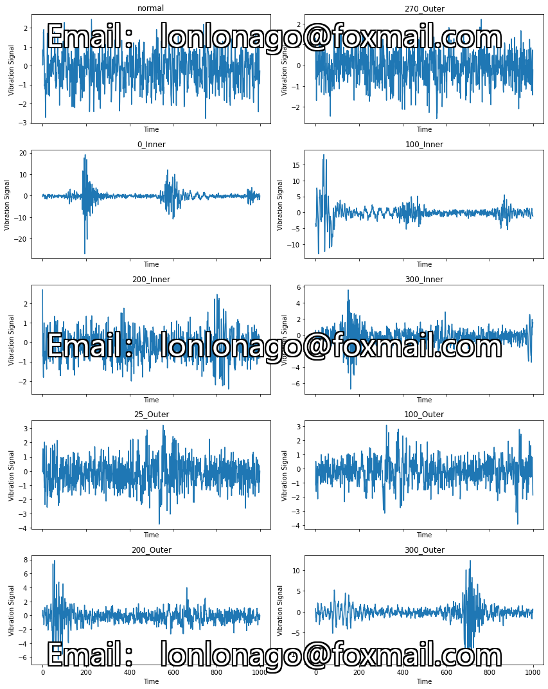
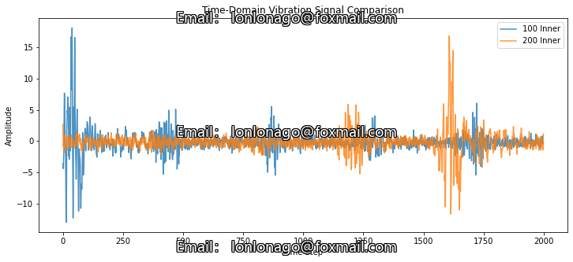
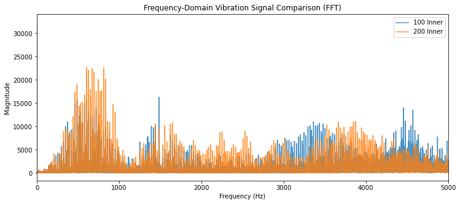
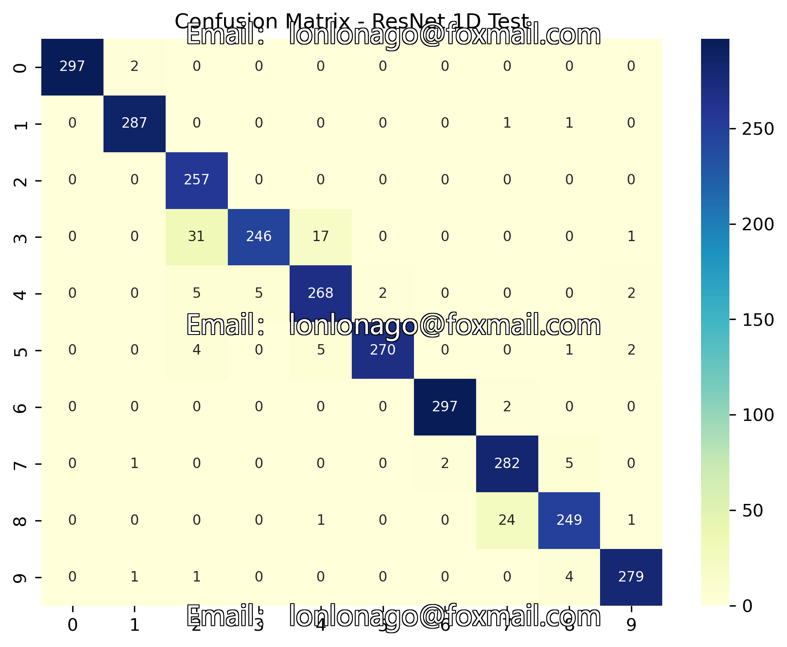
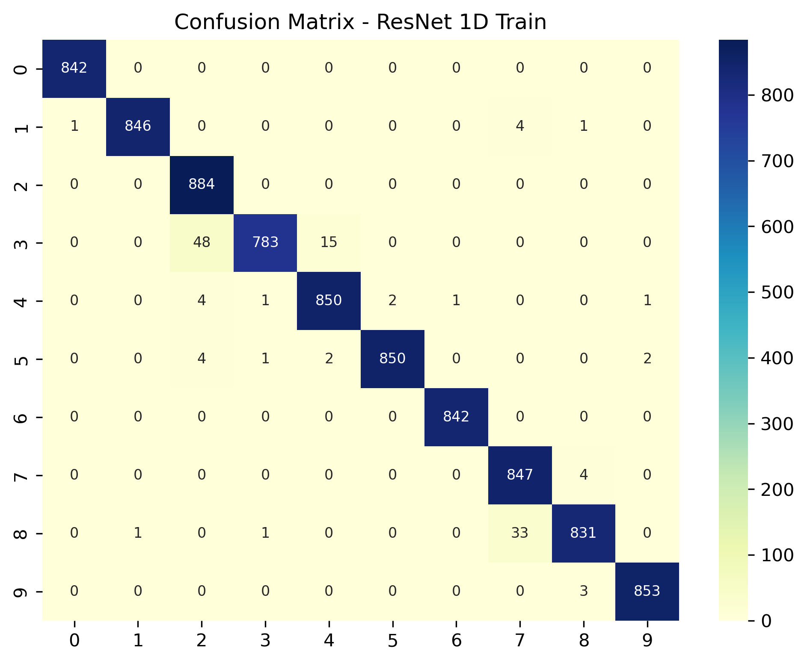
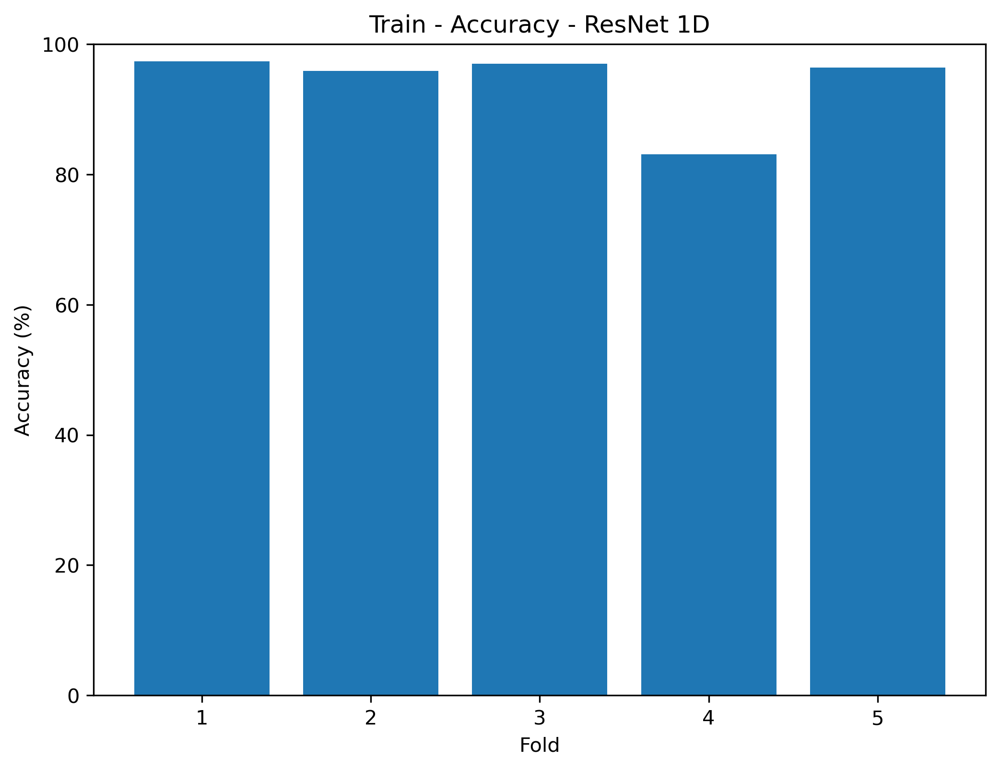
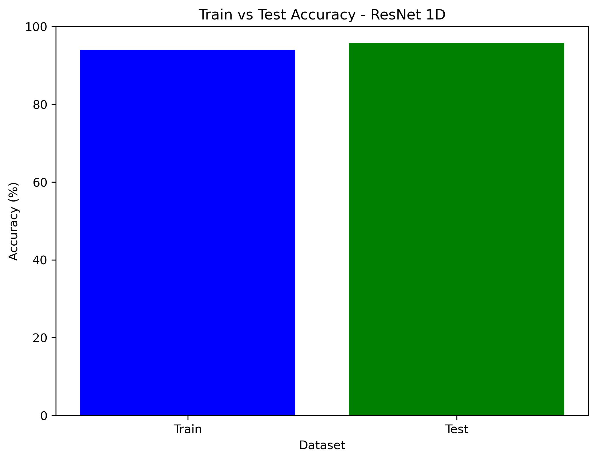

# ResNet-based Rolling Bear Fault Diagnosis with KAN (Python, MFPT dataset)

## ResNet-based Fault Diagnosis for Rolling Bears with KAN (Python, MFPT dataset)

```python
import os
import numpy as np
import pandas as pd
import torch
import torch.nn as nn
import torch.optim as optim
import torch.utils.data as data
import matplotlib.pyplot as plt
import seaborn as sns
from sklearn.model_selection import train_test_split, KFold
from sklearn.metrics import confusion_matrix
```

## Image









Here is a pay link on Stripe ( https://buy.stripe.com/3cs8yP7sY87d0vu9AB ). Please contact me lonlonago@foxmail.com after funding $89, and I will send you a complete data files , thank you!


